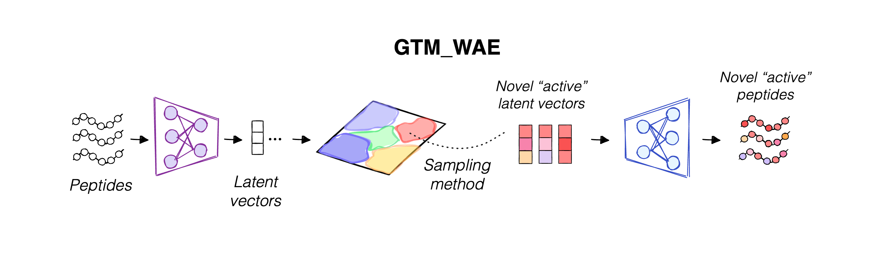

# GTM_WAE: Cartography-guided de novo generation of peptides with desired properties

GTM_WAE is a Python package of the Wasserstein Autoencoder (WAE) with attention layers in encoder and a collection of notebooks adapted for the use with non-linear dimensionality reduction method - Generative Topographic Mapping (GTM). It uses the map built on WAE latent vectors to visualize complex multidimensional latent space in 2D, making it easily explorable by human eye. The maps serve as guides to select zones to sample latent vectors that would be decoded to peptides with desired properties with high probability.

 <p></p>
 

---
<p align="center">
  <a href="https://github.com/yourproject/license">
    
  </a>
</p>

</div>

## Here are some key features of GTM_WAE for peptide generation:
- 🗺️ **Peptide Space Visualization:** Visualize the latent space in a form of 2D maps easily interpretable by human eye.
- 🔬 **Property analysis:** Colour the maps according to any property and locate the clusters of peptides with particular properties.
- 📊 **Motif analysis:** Identify predominant peptide motifs important for a property presence in a peptide cluster.
- 🚀 **Explainable de novo generation:** Use map zones populated with peptides with desired properties for the de novo generation of analogues.
- 💊 **Polypharmacological profiling:** Colour maps according to various properties (e.g., activity, cytotoxicity, etc.) to perform multi-property constrained generation.
- 🔍 **Library comparison:** Compare different libraries or databases to analyze their diversity and coverage.

## Installation

### Setting Up Your Environment

Before installing GTM_WAE, ensure that your system has Python installed, with a version **less than 3.12**. For managing Python environments and dependencies, it is recommended to use Conda or [Miniforge](https://github.com/conda-forge/miniforge).

**Create and activate a Conda environment:**

```bash
conda create -n gtm_wae_env python=3.10 -c conda-forge
conda activate gtm_wae_env
```

### Cloning the Repository
**With git:**

```bash
git clone https://github.com/Laboratoire-de-Chemoinformatique/GTM_WAE.git
```

### Installation

Install GTM_WAE using pip after activating your environment:

```bash
cd GTM_WAE/
pip install -e .
```

### Adding Environment to Jupyter

To use GTM_WAE within Jupyter notebooks, you'll need to add your Conda or virtual environment as a kernel:

```bash
python -m ipykernel install --user --name=gtm_wae_env --display-name="GTM_WAE"
```

This will allow you to select this environment inside Jupyter as a kernel


### Updating to a Newer Version

To update GTM_WAE to the latest version:

1. Go to the folder where GTM_WAE was cloned:

    ```bash
    cd GTM_WAE/
    ```

2. Pull the new version with git:

    ```bash
    git pull
    ```

    You will need to specify your login and access token.

If you did not install GTM_WAE with the `-e` option, you would also need to manually update it in your environment:

1. Activate your environment:

    ```bash
    conda activate gtm_wae_env
    ```

2. Install the package:

    ```bash
    pip install .
    ```

### Installation for Developers

Developers should install dependencies via Poetry, which can also be managed through Conda:

```bash
conda install poetry -c conda-forge
poetry install
```

If you encounter any issues with Poetry related to environment variables, add the following line to your `~/.bashrc` file:

```bash
echo 'export PYTHON_KEYRING_BACKEND=keyring.backends.null.Keyring' >> ~/.bashrc
exec bash
```


## Main developers
- **Karina Pikalyova** - Ph.D. student in the laboratory of chemoinformatics (karinapikalyova@gmail.com)
- **Dr. Tagir Akhmetshin** - Postdoctoral researcher in the laboratory of chemoinformatics (tagirshin@gmail.com)
- **Dr. Alexey Orlov** - Postdoctoral researcher in the laboratory of chemoinformatics (2alexeyorlov@gmail.com)
- **Prof. Alexandre Varnek** - Director of laboratory of chemoinformatics (varnek@unistra.fr)


